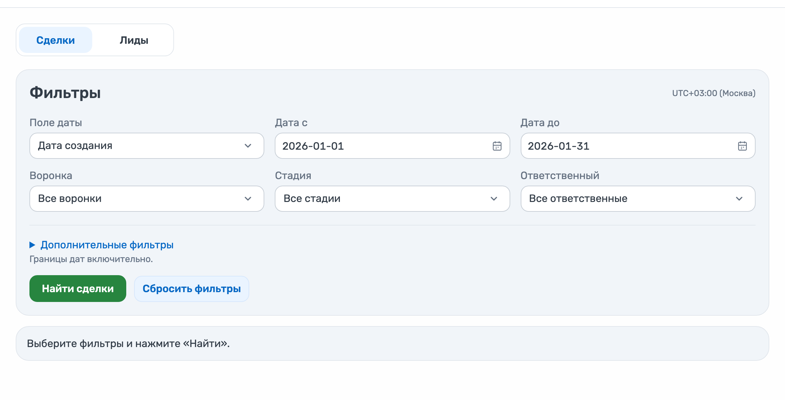
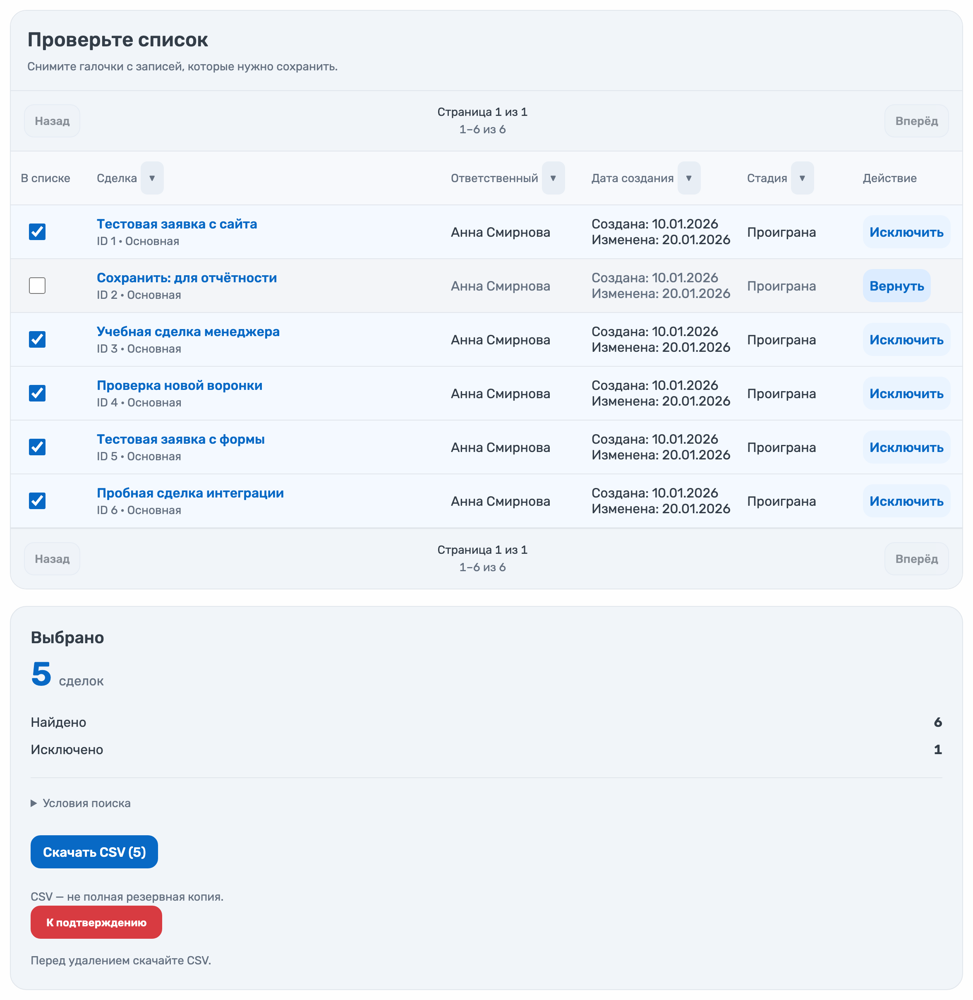
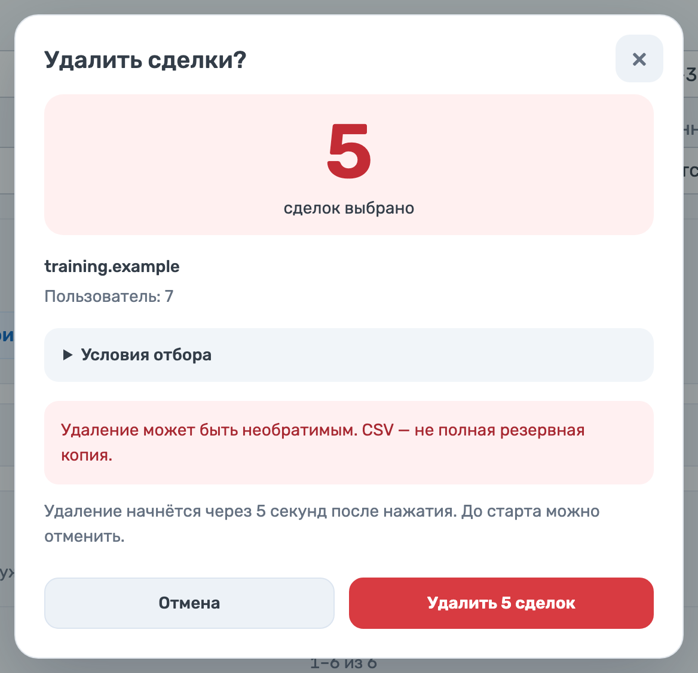
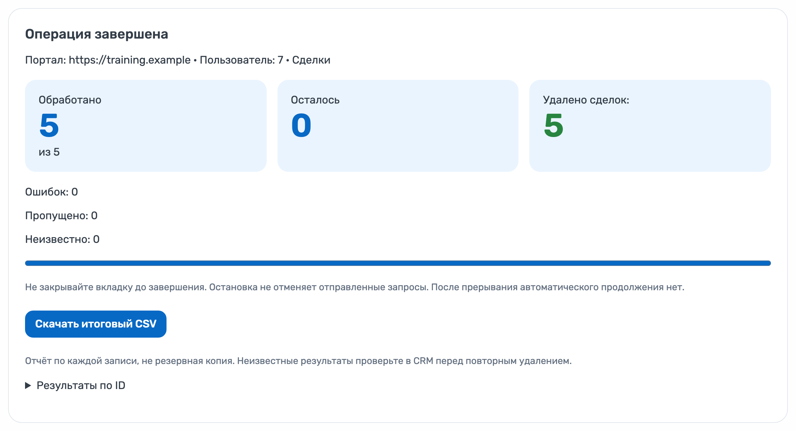

# Массовое удаление лидов и сделок

## Как пользоваться — 4 шага

На скриншотах — учебные данные. Откройте приложение в Битрикс24 под администратором.

### 1. Найдите записи

Выберите **«Сделки»** или **«Лиды»**, укажите период и нажмите **«Найти сделки»** или **«Найти лиды»**.

### 2. Проверьте список

Снимите галочки с записей, которые хотите сохранить. Скачайте CSV выбранных записей и нажмите **«К подтверждению»**.

### 3. Подтвердите удаление

Проверьте количество и нажмите **«Удалить 5 сделок»**. До начала удаления будет **5 секунд**, чтобы отменить запуск.

### 4. Сохраните результат

Дождитесь завершения, не закрывая вкладку. Проверьте результат и нажмите **«Скачать итоговый CSV»**.

> CSV — отчёт, а не полная резервная копия. У приложения нет автоматической отмены уже выполненного удаления.

---

### Для размещения на странице продукта

Показывайте шаги по порядку: короткая подпись и один скриншот. На телефоне — одна колонка, изображения открываются по нажатию в полном размере. Подтверждение показывайте отдельным компактным изображением, без окружающей страницы.

### О снимках

Сняты 27 сентября 2026 года с актуального локального интерфейса приложения. Данные и ответы CRM искусственные; обращения к внешним серверам заблокированы. Проверены исключение одной записи, обработка остальных пяти и обе выгрузки CSV. Это иллюстрация сценария, а не проверка удаления в действующем портале Битрикс24.
